# Epidemic Engine Data Pipeline

## Final Project
### Run Instructions
1. Clone the repo, navigate to final-project directory - `cd final-project`
2. Run `make deploy-dc` to deploy the various services with docker-compose
3. To view graphs, navigate to `localhost:5000` in browser
4. To generate various models, run `make generate-models`
5. To run prediction, run `make run-prediction`

## Outputs
### Webpage 
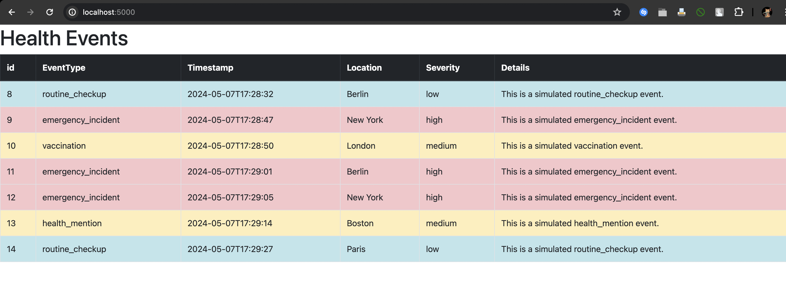

[More Details in end]

## Project 1
### Part 1: Batch Data Analysis with Hadoop
### Run Instructions
1. Clone the repo, navigate to hadoop directory - `cd hadoop`
2. Run `make build-hadoop-customized-images` to build customized hadoop images
3. Run `docker-compose up -d` to bring up the hadoop components
4. After hadoop is up, run this - `make hadoop_solved` to run both event_counter and location_mapreducer tasks

### Outputs
#### Map Reduce Running Task
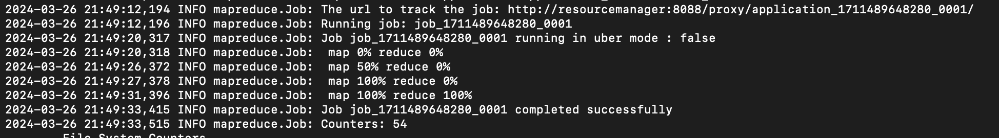

#### Event Counter Output
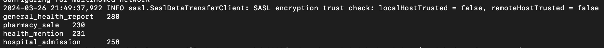

### Location Map Reducer Output
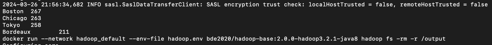

## Project 2
### Part 1: Data Ingestion and Categorization with Kafka

### Run Instructions
1. Clone the repo, navigate to kafka-server directory - `cd kafka-server`
2. Run `docker-compose up -d` to bring up the kafka components
3. After both kafka and app containers are up, you can try looking at the progress by running the commands given below

### Outputs
#### Consuming Events
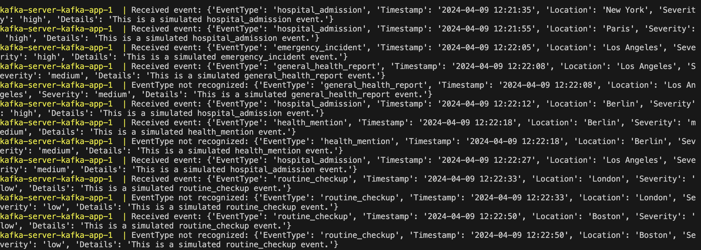

#### Topics Created
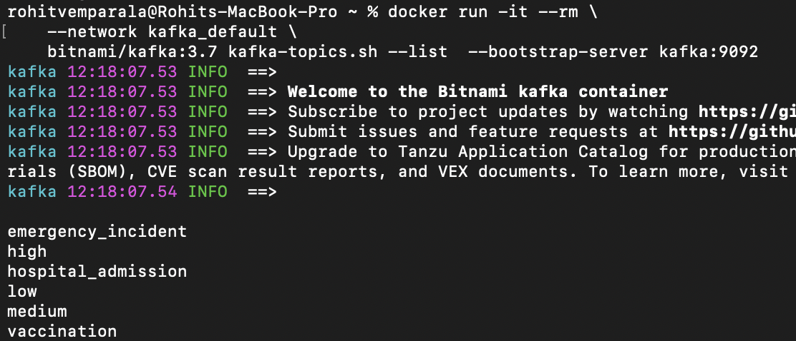

#### List events in a topic
```
docker run -it --rm --network kafka_default bitnami/kafka:3.7 kafka-console-consumer.sh --bootstrap-server kafka:9092 --topic low --from-beginning --max-messages 10
```

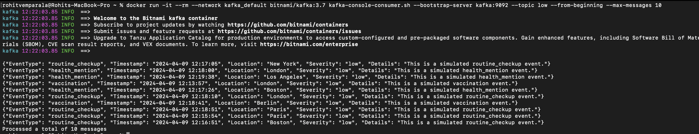

### Part 2: Exploring with Apache Spark

### Run Instructions
1. Clone the repo, navigate to spark-explore directory - `cd spark-explore`
2. Run `docker-compose up -d` to bring up the spark and kafka components
3. After both kafka and spark containers are up, you can first get the token URL generated in the output logs to connect to the jupyterlab server running in docker
4. Run the file `spark_eda_kafka.ipynb` either via jupyter UI or from your own IDE - connect to the jupyter server first

### Outputs

### Event Count over time
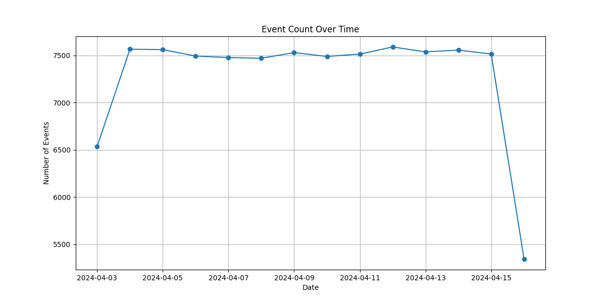

### Event Frequency by Type
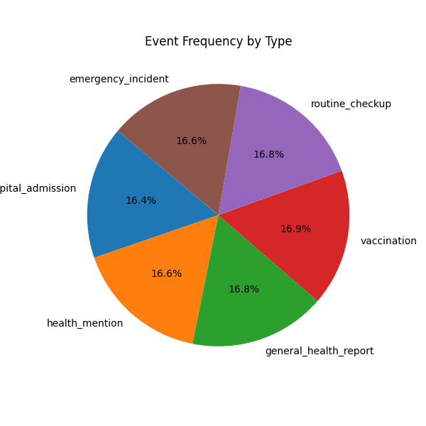

### Event Severity Counts by Hour
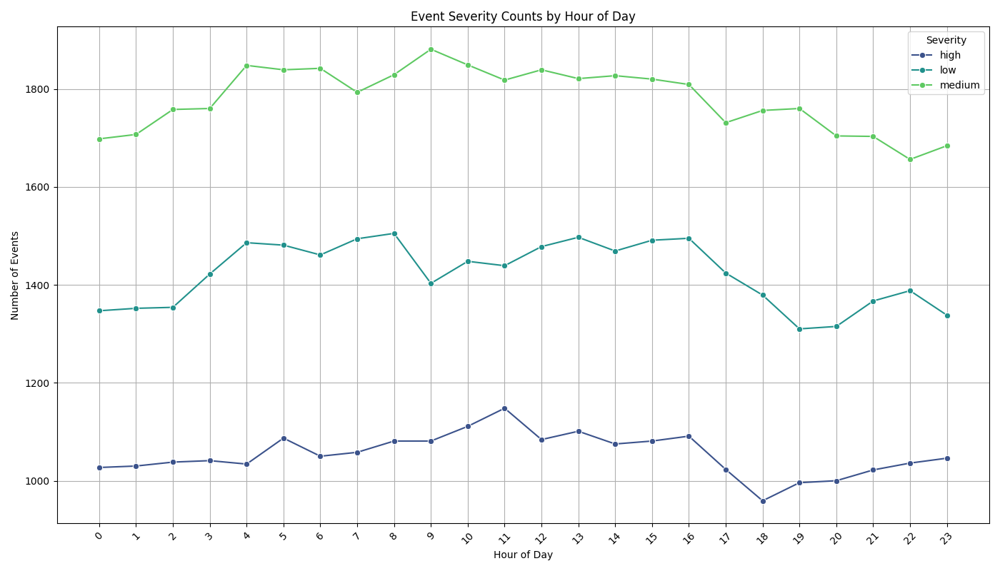

### Facet Grid of Event Types and Severity by Hour
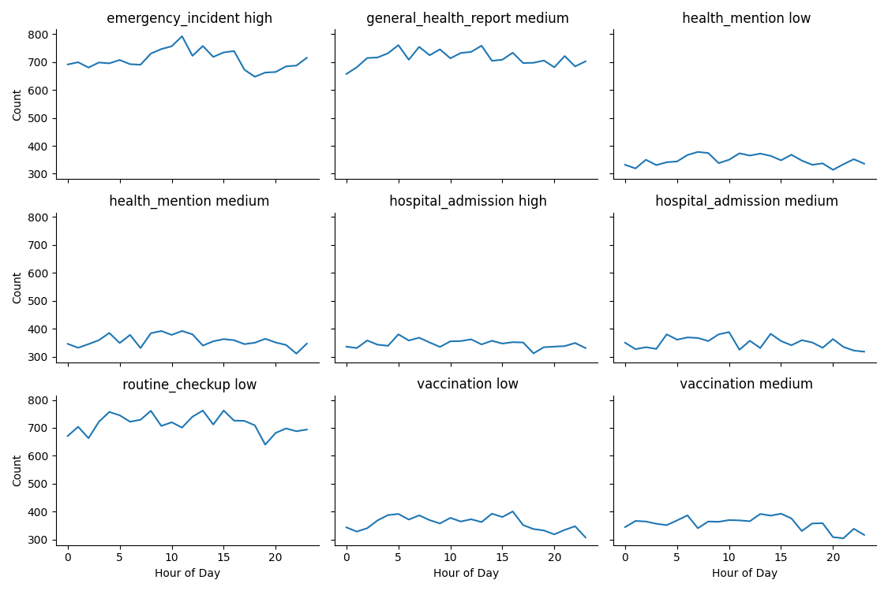

### Geographical Distribution of Events
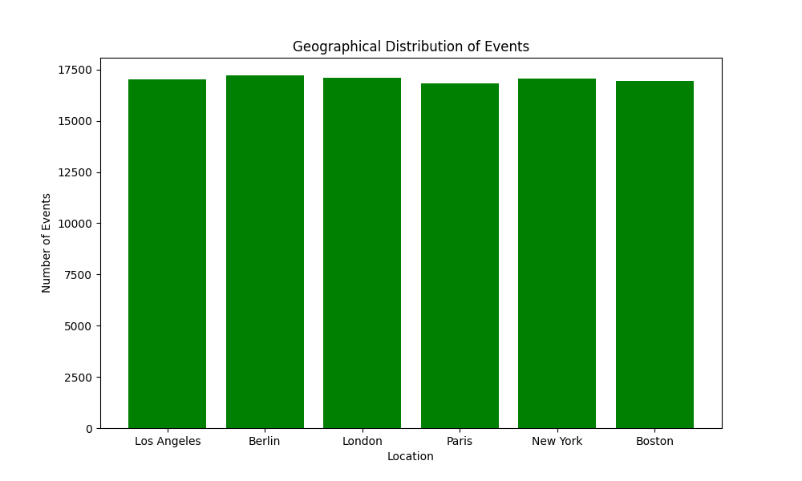

### Heatmap of Event Types and Severity
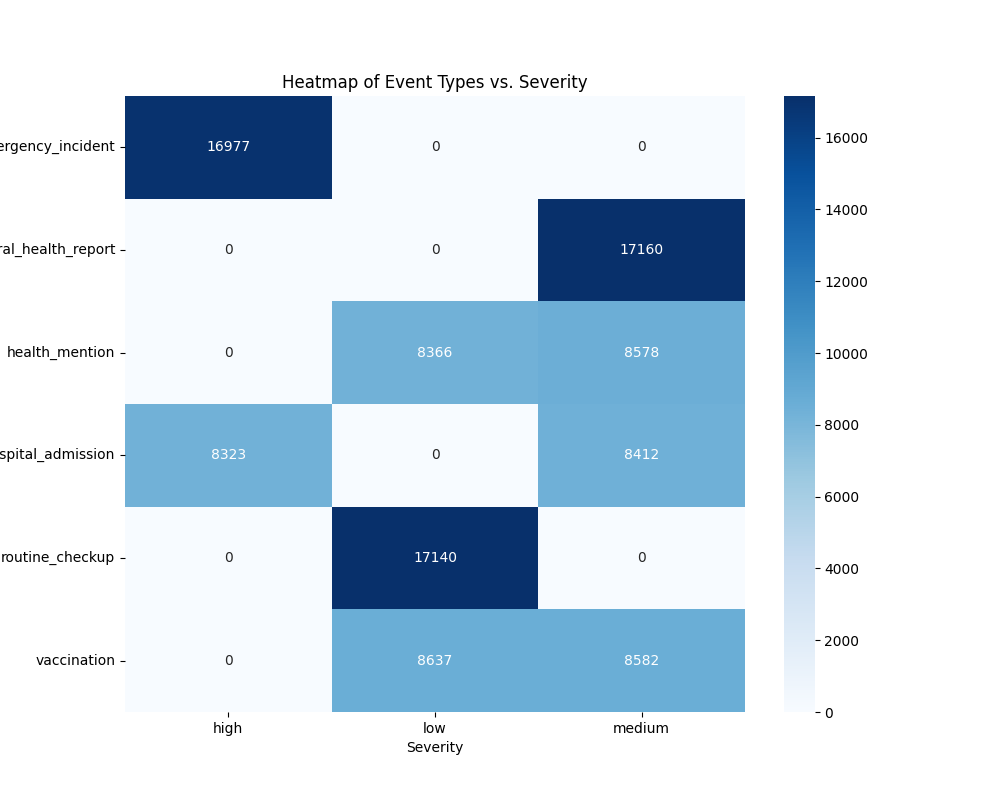

### Stacked Bar Chart of Event Types and Severity
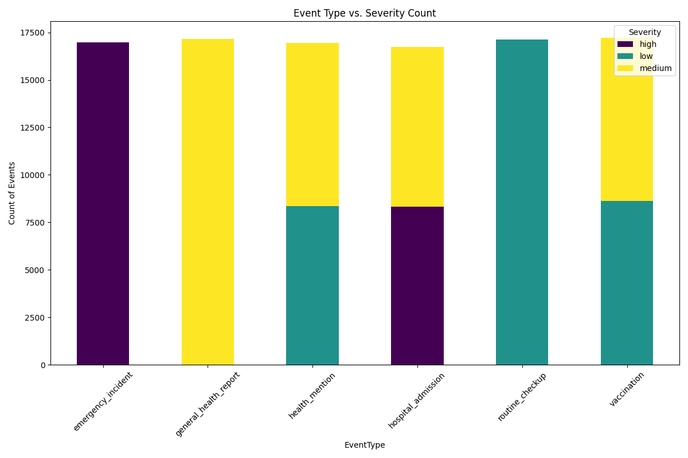

#### Token
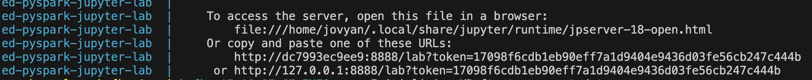

### Part 3: Advanced Analytics with Apache Spark

### Run Instructions
1. Clone the repo, navigate to spark-explore directory - `cd spark-explore`
2. Run `docker-compose up -d` to bring up the spark and kafka components
3. After both kafka and spark containers are up, you can first get the token URL generated in the output logs to connect to the jupyterlab server running in docker
4. Run the file `spark_ml_model.ipynb` either via jupyter UI or from your own IDE - connect to the jupyter server first.

### Anomaly Detection Model Documentation

- **Purpose**: Detect anomalies in health event data using KMeans clustering implemented in PySpark.
- **Data Input**: CSV file containing 1 million health event records, loaded and processed with inferred schema.
- **Features**:
  - **Categorical**: Event type and location are indexed and encoded.
  - **Numerical**: Severity levels are converted from categorical ('low', 'medium', 'high') to numerical values.
- **Feature Engineering**:
  - Data features are assembled into vectors and scaled.
- **Modeling**:
  - KMeans clustering with hyperparameter tuning using cross-validation.
  - Cluster number (`k`) and standard deviation scaling are the tuned parameters.
- **Evaluation**:
  - Clustering performance is evaluated using the silhouette score.
  - Classification metrics (Accuracy, F1 Score) are calculated post-hoc to assess anomaly detection.
- **Results**:
  - Outputs include the model parameters and prediction results.
  - Predictions and model are saved to specified paths.
- **Usage**:
  - Model is used to classify new data points as anomalies based on learned cluster characteristics.

### Outputs

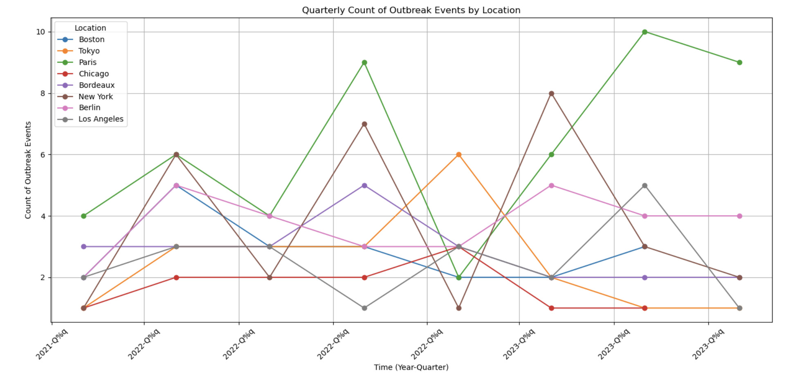


## Project 3 (Final Project)

### Run Instructions
1. Clone the repo, navigate to final-project directory - `cd final-project`
2. Run `make deploy-dc` to bring up the images for kafka, postgres, flask, spark in final-project
3. After all containers are up, you can try looking at the progress by running the commands given below

### Features:
- The data fetched from Kafka is stored in Postgres (load_db container).
- Additionally, check out the webpage at `localhost:5000` . This page has realtime graph for streaming data from kafka, graphs for past outbreaks from data provided (https://langdon.fedorapeople.org/1m_health_events_dataset.csv) and realtime updated table of data incoming from spark.

### Spark ML Model Documentation

#### Model Usage
- **Initial Setup**: This model, based on the implementation from "Project 2, Part 3," has undergone minor modifications for enhanced performance. It is executed as a Python script.
- **Storage**: Trained models are saved in `final-project/ml-model/saved-models`.

#### Running Custom Predictions
- **Data Preparation**: To run custom data on the trained model, store your CSV data in `final-project/ml-model/inputs`.
- **Execution**: To run custom data on trained model, store the csv data in final-project/ml-model/inputs. navigate to final-project directory  and run `make run-prediction` where user is prompted. This interaction will provide a command in terminal, copy that and run.

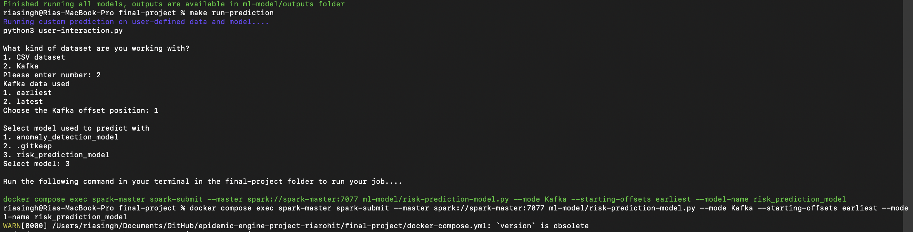

- **Results Handling**: Output predictions are stored in `final-project/ml-model/outputs`. It is recommended to delete these files after reviewing to avoid storage overflow and ensure data privacy.

#### Model Retraining Configuration
- **Initial Training**: The model is initially trained using a dataset containing 1 million records, which is adequate for initial deployment. Post this, user can select data source (CSV or Kafka) and get predictions by running it through trained model.
- **Re-training**: For ongoing accuracy and relevance, the model supports retraining on custom datasets. This can be initiated as needed, depending on the evolution of the data it is applied to or specific user requirements.
- **Performance Metrics**: For performance metrics accuracy ( result: 93.7%) and F1-score(result: 96.7%) of model  are considered. 
- **Procedure**: To retrain, replace the dataset in `final-project/ml-model/inputs` with the new data and execute the training command as outlined in the setup instructions.
- **Risk Prediction Model**: A complementary model using Random Forest and cross-validation is also available, which operates identically.

### Outputs
#### Dashboard

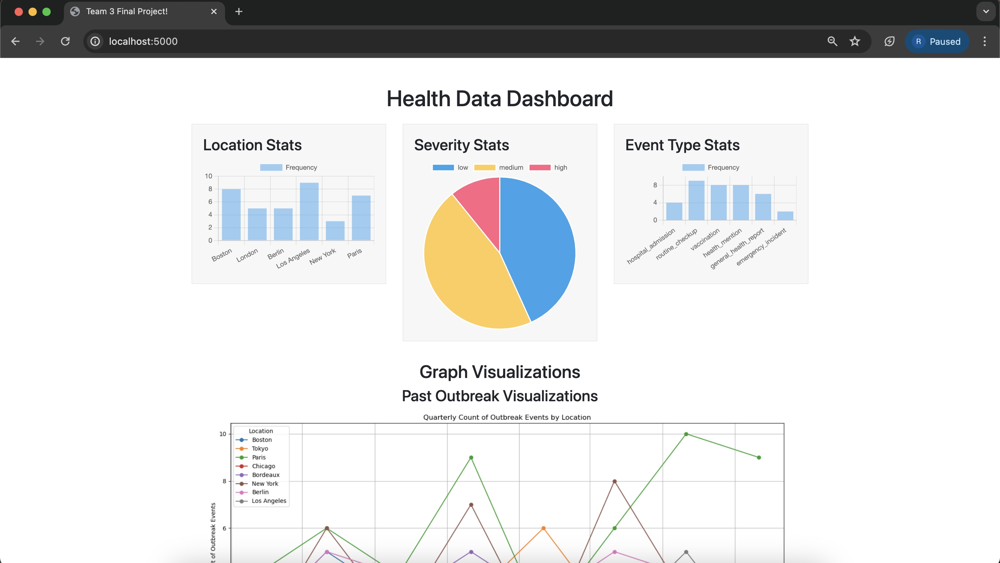

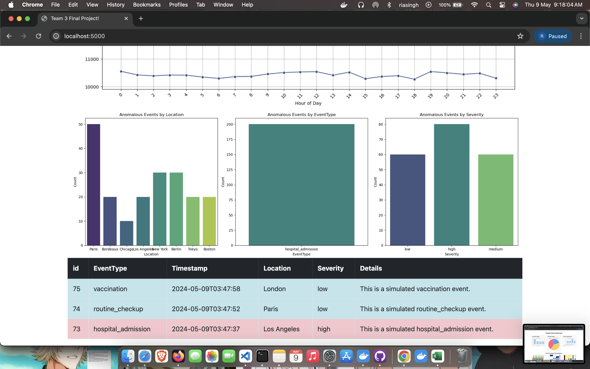


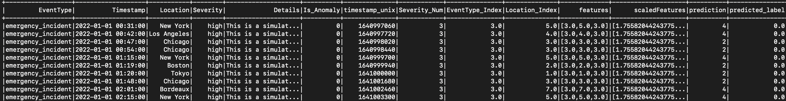
